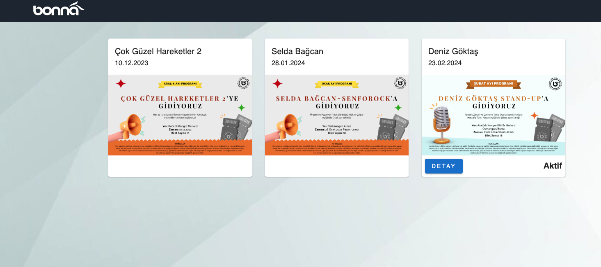
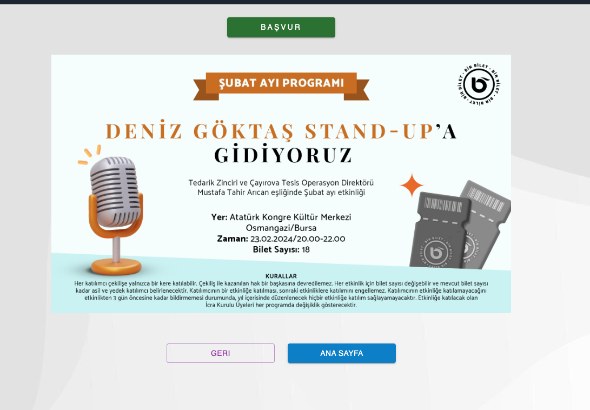
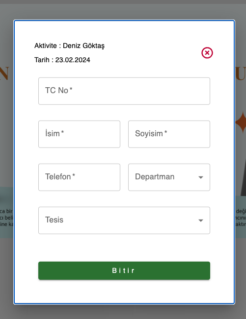
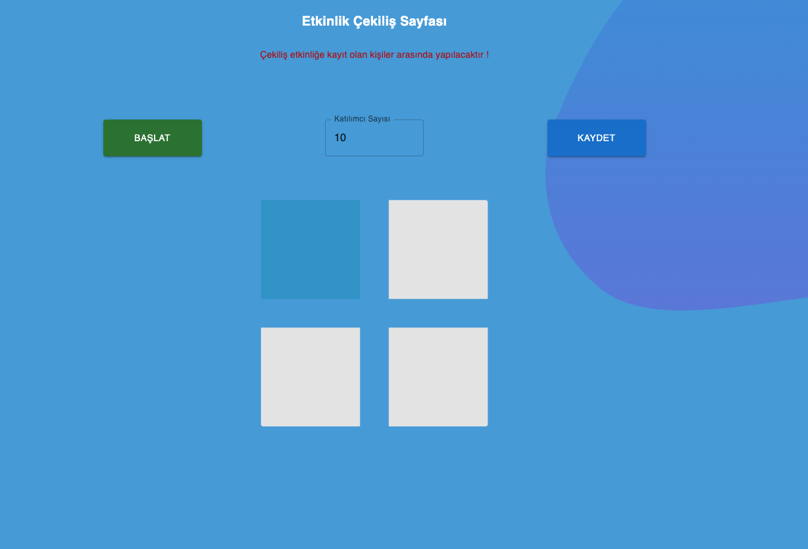
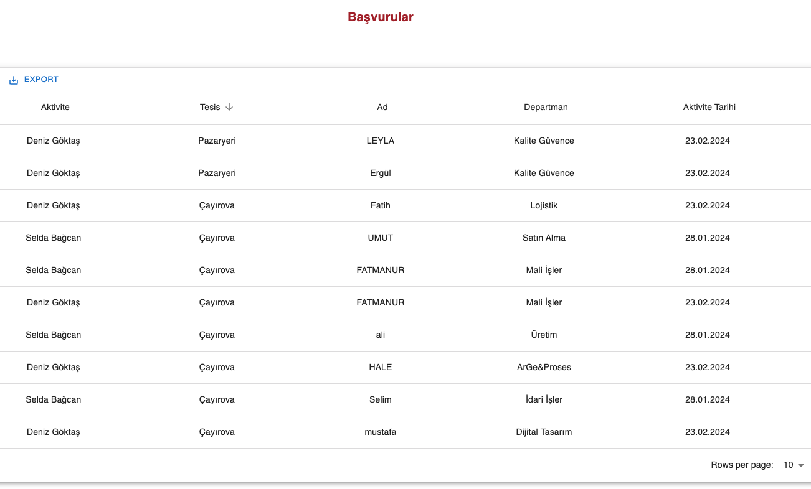

# Bonna_Raffle_App

#### About Project : 
##### The application was made to hold a raffle among company employees.
##### All company employees apply for the live raffle by accessing the application page via QR code or URL address.
##### Application cannot be made when the application period has expired.
##### There is integration between the application and the API service to which company employees are registered.
##### Thanks to the integration, it is checked that the applicants are employees of the company.
##### All application and lottery data are recorded in the firebase database.
##### The number of printouts is entered to make the draw.
##### The result of the main and reserve list will be as much as the number entered.
##### The main list results are recorded in the winners table.


## Installation

Install Bonna_Raffle_App

```bash
  npm install Bonna_Raffle_App
  cd Bonna_Raffle_App/current_version folder
  npm install node_modules
  npm start or yarn start or pnpm dev&start
```

## Images






